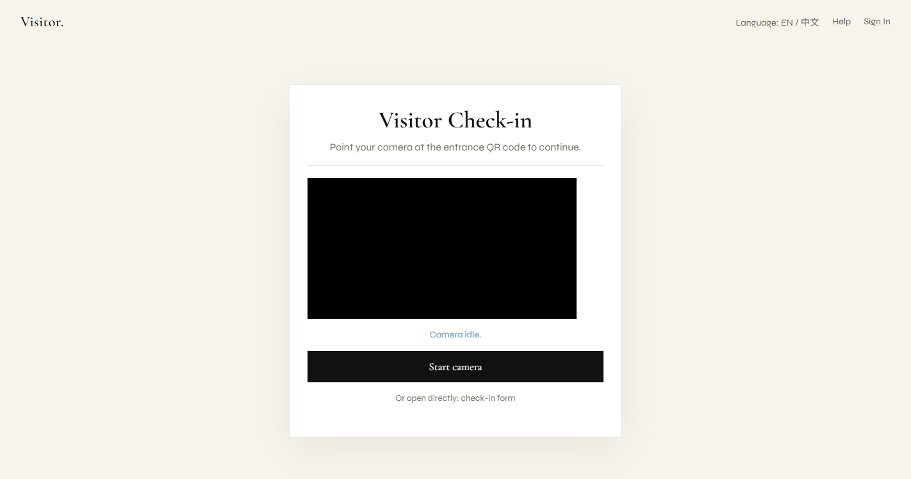
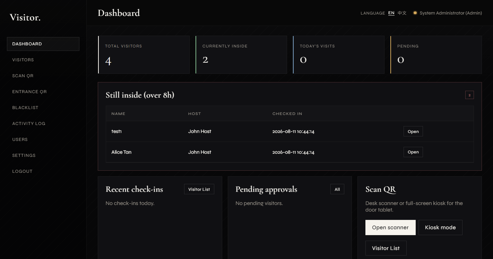

# Visitor. — Management System

Editorial-styled visitor management for XAMPP (PHP + MySQL).

## Setup

1. Start **Apache** and **MySQL** in XAMPP.
2. Open [http://localhost/Visitor/install.php](http://localhost/Visitor/install.php) (fresh DB) — or just open the app; schema upgrades run automatically.
3. Sign in: **admin** / **password**
4. Delete `install.php` after install.
5. For production: set `APP_DEBUG` to `false` and change `APP_SECRET` in `config/config.php`.

## Default users

| Username   | Password | Role     |
|------------|----------|----------|
| admin      | password | Admin    |
| security1  | password | Security |
| staff1     | password | Staff    |

## Screenshots

> Screenshots can be regenerated locally with: `python docs/capture_screenshots.py` (requires Selenium + Chrome).

## Features

- Dashboard metrics (clickable), pending approvals, overdue “still inside”
- Visitors search/filters, approve / check-in / check-out, photos
- Host email notifications (register / check-in / check-out)
- Badge print sheet with signed QR (7-day signature)
- Scan QR + upload image + kiosk mode
- Entrance QR → public check-in (with optional selfie)
- Blacklist enforcement
- Activity log + CSV export
- Users & roles (Staff only sees own hosted visitors)
- Forgot / reset password
- Settings + change password
- EN / 中文 language switch
- User manual

## Config

Edit `config/config.php` for DB, mail, overdue hours, and notification toggles.
